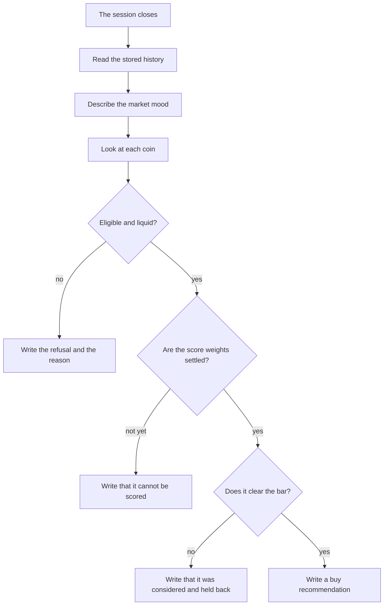
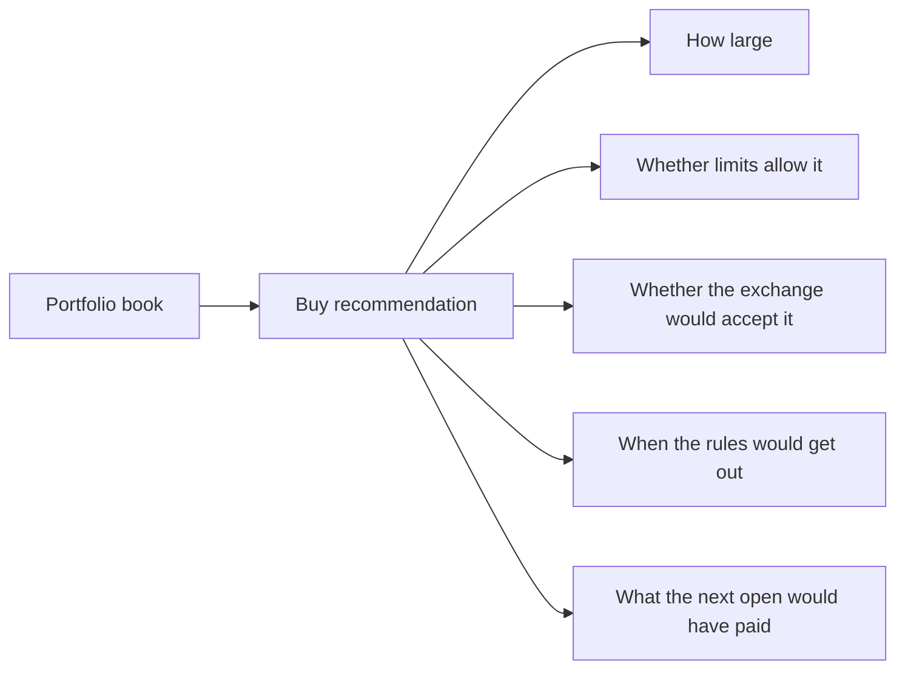

# Crypto Intelligence Platform

CIP keeps a research book for Binance spot. Each day it writes what it would
recommend, and why, from prices and signals that were already stored. It does
not send those notes to the exchange.

A buy in this book is a suggestion with the evidence attached. Cash, and a
decision not to buy, are valid outcomes. The platform is running in shadow
mode: it observes and records. There is no live trader in this repository.

## How a session becomes a note

After a trading session closes, CIP reads that session from its own history.
It does not go back to the exchange to fill in gaps. If something required is
missing, the coin is refused.

It starts with the market mood. Bitcoin, the rest of the universe, and a few
market-wide readings (such as Bitcoin's share of the market and futures
funding) decide whether new ideas are even welcome.

Then it walks each coin in that day's snapshot:

1. Is the coin eligible, liquid enough, and acceptable on the basic checks?
2. If it is, can it be ranked? Ranking runs only when the caller brings the
   score weights. Those weights are not settled yet, so a normal scan records
   that the coin cannot be scored. CIP will not invent a ranking to produce a
   buy.
3. If a coin does clear the bar, the note is a buy recommendation. Otherwise
   the note says it was scored and held back, and why.



The original note stays as it was written. Later, CIP can attach what the coin
did after one week, two weeks, one month, and two months. Those results sit
beside the decision. They do not rewrite it.

## What the book keeps around a recommendation

The recommendation is the decision. Around it, the book can keep the notes a
careful portfolio would want. Each one is its own page. None of them is an
order.

The portfolio page records how capital is split, plus any coins the owner has
typed in by hand. The owner has not supplied a definitive inventory yet, so
holdings stay approximate. Cash that has not been entered is left blank. Blank
is not zero.

From there the book can also record:

- how many dollars a discovery position would be, or that it is too small to take
- whether the risk limits would allow a new entry
- whether the exchange's own rules would accept the coin, including room to get out after fees
- which exit rule, if any, would apply to an open position
- what the next morning's open would have implied as a price, after fees and a little slippage

A missing next-day open is not turned into a fill. A buy that would spend past
the day's or the month's buy budget is not filled. A sell is still priced,
because getting out is not blocked by the budget for new buys.

A position can move from proposed, to approved, to open, and eventually to
closed. A proposal that is not taken can close without ever opening. Every
move is recorded. The position page does not carry an order id.



## How the capital is split

The published policy keeps three sleeves apart so they do not spend each
other's money.

Most of a contribution is the core: Bitcoin and Ethereum, about seventy
percent Bitcoin and thirty percent Ethereum inside that sleeve. That sleeve is
a schedule, not a scored idea. A smaller share is discovery, the coins outside
that pair, and that is the sleeve with the tight risk limits. The rest is a
reserve that stays in USDC until a later rule says how to use it.

October 2026 is a short pilot with its own capital. It is not the normal
monthly contribution, and thirteen days is not evidence for or against the
strategy. From November, the published contribution is 800 dollars a month.
The book is never required to spend money just because it is available.

## What is running

The research record is in place: stored history, one decision per coin for a
closed session, the portfolio book, position states, and the notes for size,
limits, exchange rules, exits, and shadow prices.

An hourly job in the dev environment records that a cycle started and
finished. It does not rank coins. Ranking belongs to the daily decision, and
only from stored inputs.

Still ahead: writing the weekly Bitcoin and Ethereum purchases into the book,
a place to record the owner's own October buys, a scorecard that judges the
research on more than profit and loss, and a production shadow environment.
The score weights stay unset until the evidence can support them.

Diagrams of the flows and the engines are in the
[implemented solution](docs/architecture/implemented-solution.md).
The longer target design is the
[reference architecture](docs/architecture/reference-architecture-v1.0.md).
The [roadmap](docs/plans/2026-10-03-roadmap.md) lists what is done and what is
still open.

## Develop

```text
make install
make check
make build
```
