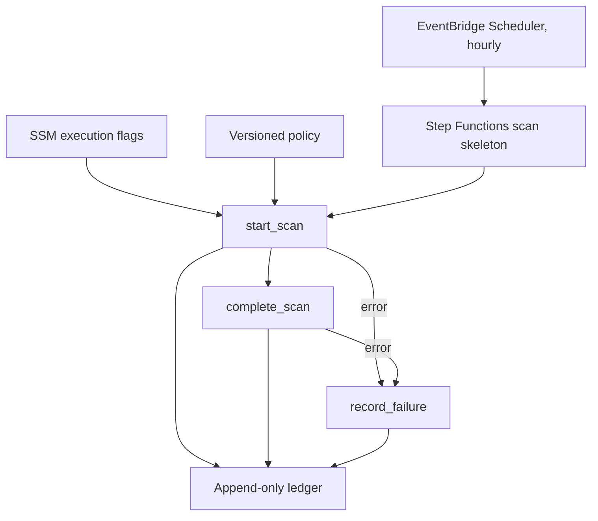
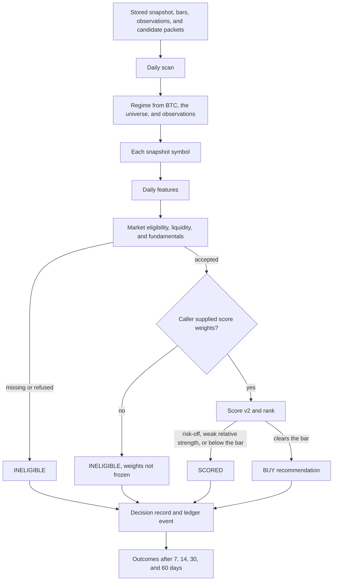
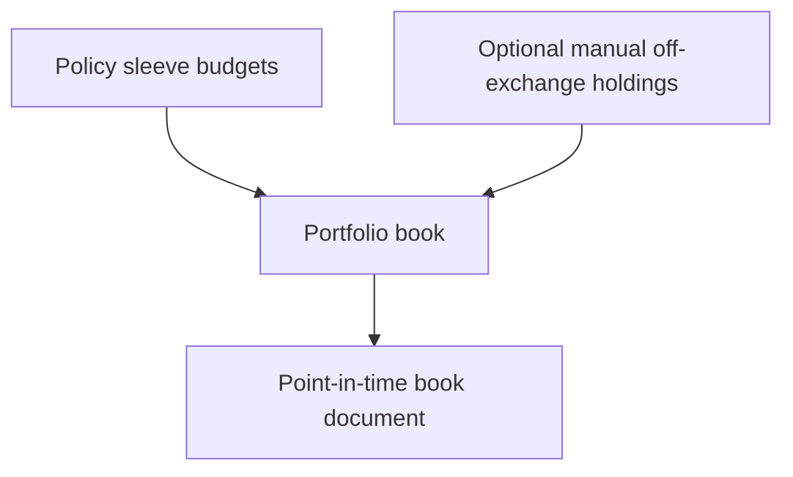
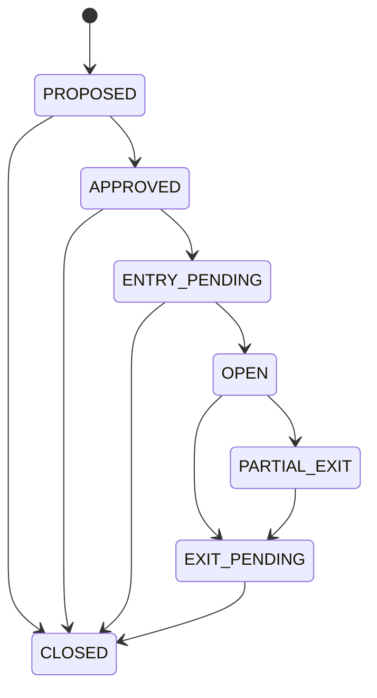
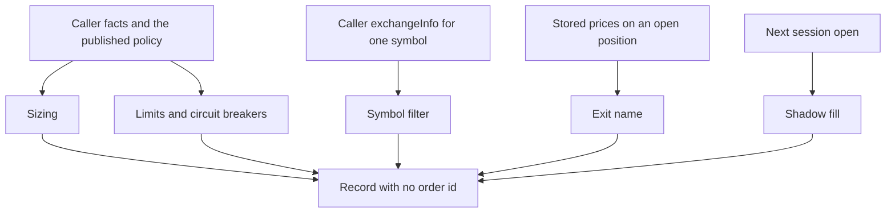
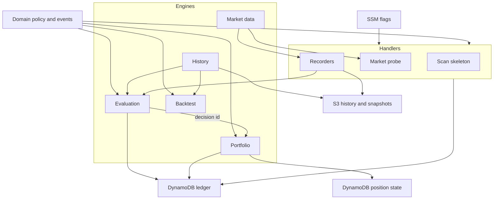

# Implemented solution

This note is the engine and flow map for what CIP runs today. The project
introduction is the [repository README](../../README.md).

AWS-native research platform for Binance Spot. It records deterministic
recommendations from stored market history and a versioned policy. The
operating mode is **SHADOW**. A `BUY` is a recommendation. Execution flags
fail closed. This repository has no live executor.

The target design remains
[`reference-architecture-v1.0.md`](reference-architecture-v1.0.md).
This page describes the engines under `src/cip` and the dev pipeline that
runs today.

- Roadmap: [`../plans/2026-10-03-roadmap.md`](../plans/2026-10-03-roadmap.md)
- Position lifecycle: [`../plans/2026-10-05-m4-position-lifecycle.md`](../plans/2026-10-05-m4-position-lifecycle.md)
- ADRs: [`../adr/`](../adr/)

## Boundary

The repository policy sets `execution.mode` to `SHADOW`. SSM flags that cannot
be read become SHADOW, with trading disabled and the kill switch on. Market
data in AWS uses `https://data-api.binance.vision` from us-east-1. A host
response of 418 aborts the call. A 451 is recorded as a failure.

Score v2 applies only weights the caller supplies. With no weights the symbol
is `INELIGIBLE` and the reason is `score_weights_not_frozen`. The information
coefficient study reports coefficients and does not choose weights.

The portfolio book copies sleeve budgets from policy. It does not turn the
starting value into coin quantities. Manual off-exchange lines are optional,
and an empty list is valid. Holdings stay approximate until the owner supplies
an inventory. Sleeve cash may be missing. Missing cash is not zero.

A size, a limit decision, a symbol screen, a named exit, and a shadow fill are
documents. They carry no order id. A later caller applies a position
transition.

## Scheduled scan skeleton

Dev runs an hourly EventBridge schedule into a Step Functions Standard state
machine. The machine records the run. It does not score symbols. The strategy
timeframe is the daily close. Switching this schedule to that close is still
open on the roadmap.



Ledger types on this path are `SCAN_STARTED`, `SCAN_COMPLETED`, and
`PIPELINE_FAILED`. The same hour, a recorder Lambda appends observations for
BTC dominance, stablecoin supply, futures funding, open interest, and spot
depth. A failed fetch is a failure record, and it is not a bar.

## Daily decision record

`run_daily_scan` evaluates one closed session from stored inputs. It does not
call a provider. Each snapshot symbol gets one immutable decision. Forward
outcomes at 7, 14, 30, and 60 days are written beside that decision after the
horizon has elapsed. The outcome does not rewrite the decision.



The `BUY` reason code is `buy_recommendation`. The decision schema labels a
cohort `BACKTEST`, `ALPHA_PILOT_2026_10`, `SHADOW`, or `LIVE`. The deployed
flags and the policy mode stay SHADOW.

## Portfolio lifecycle

These functions share the policy. A position also shares one decision id.
They are separate calls. The repository does not chain them into an order.

The book file is `portfolio/date={session}/book.json`. The same bytes are a
no-op. A different payload is refused.



A position follows one decision. `position_id` is the SHA-256 of that decision
id. The state row is `PK=POSITION#<id>`, `SK=STATE`. Every move is one
`POSITION_TRANSITIONED` ledger event in the same transaction. The record has
no quantity.



A proposal can reach `CLOSED` without opening. An open position reaches
`CLOSED` only through `EXIT_PENDING`. `CLOSED` has no next state.

Entry and exit research each return their own document:



- **Sizing** returns dollars, or no size when the result is below the minimum, the regime is risk-off, or the regime is missing.
- **Limits** allow a new discovery entry only when every check is clear. A missing fact is refused. A flatten name is a review. It is not a sell.
- **Symbol filter** reads the caller's current `exchangeInfo`. It does not fetch the exchange. A name that cannot trade, quote, tick, or exit after the taker fee is skipped.
- **Exits** name at most one rule for `OPEN` or `PARTIAL_EXIT`: a forced trigger, the binding stop, max hold, the time stop, or a partial take-profit. No name is a hold. The result has no price and no quantity.
- **Shadow fills** price one buy or one sell at the next session open. A missing open, a zero quantity, or a buy that would exceed the daily or monthly buy budget produces no fill. A sell is priced anyway and does not spend the buy budget. Cost is the taker fee, half the caller spread, and the caller slippage. A smaller quantity is a partial fill.
- **Core weeks** split the monthly core budget across the caller's week count, then split that week with the DCA allocator. The reserve stays at zero. The document is dollars, and publishing it recomputes the week from the policy.
- **Pilot executions** record an owner purchase on `ALPHA_PILOT_2026_10` between 2026-10-19 and 2026-10-31. The cap is 500 USD. The note has no order id.

Applying a fill or an exit name as a position transition is a later caller.
The lifecycle plan's remaining slices are the engine assurance scorecard and
prod shadow. The hourly position monitor is still a roadmap item. Band
rebalancing and reserve deployment are still open.

## Engines



| Engine | Package | What it does |
| --- | --- | --- |
| Market data | `cip.adapters` | Public Binance client, weight-aware limiter, and parsers for exchange info, tickers, klines, and depth |
| History | `cip.history` | Survivorship-free daily klines, listing continuity, and the point-in-time universe |
| Evaluation | `cip.evaluation` | Daily scan, features, gates, regime, score, decision store, outcomes, and the coefficient study |
| Portfolio | `cip.portfolio` | Book, position state, exits, sizing, limits, symbol filter, shadow fills, core weeks, and pilot executions |
| Persistence | `cip.persistence` | Append-only ledger writes, and the position row plus its ledger event in one transaction |
| Backtest | `cip.backtest` | BTC and BTC/ETH DCA replay, portfolio metrics, and a simulator that calls eligibility, score, and exit contracts |
| Handlers | `cip.handlers` | Lambda entry points for the scan skeleton, the market probe, and the recorders |

`cip.domain` holds the policy and ledger events. `cip.recorders` collects the
forward series the regime classifier reads. `cip.config` reads the SSM flags.

Dev storage follows ADR-0005: a versioned S3 bucket for snapshots, history,
and observations, plus DynamoDB tables for the ledger and for position state.
A counters table is provisioned. Daily and monthly trade-dollar counters are
still a roadmap item, so a shadow fill takes the buy-spend figures from the
caller.

## Develop

```text
make install   # uv sync and pre-commit
make check     # ruff, mypy, pytest
make build     # Lambda artifact in build/cip-lambda.zip
```
