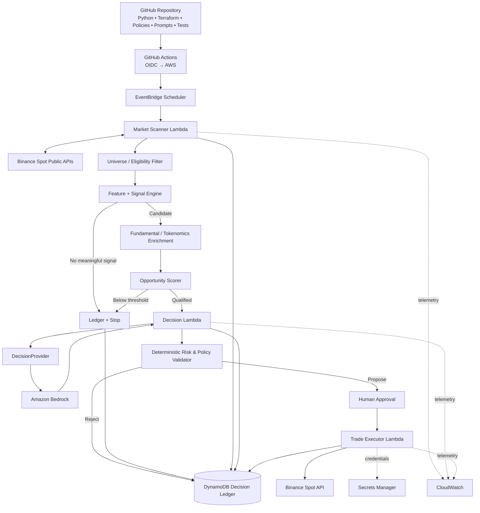
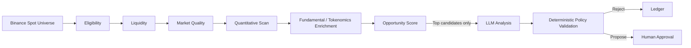
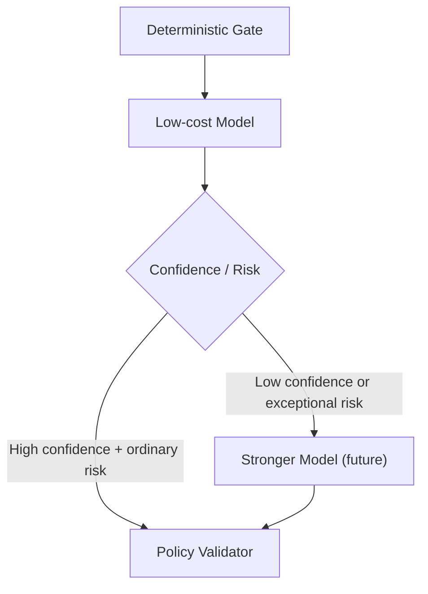
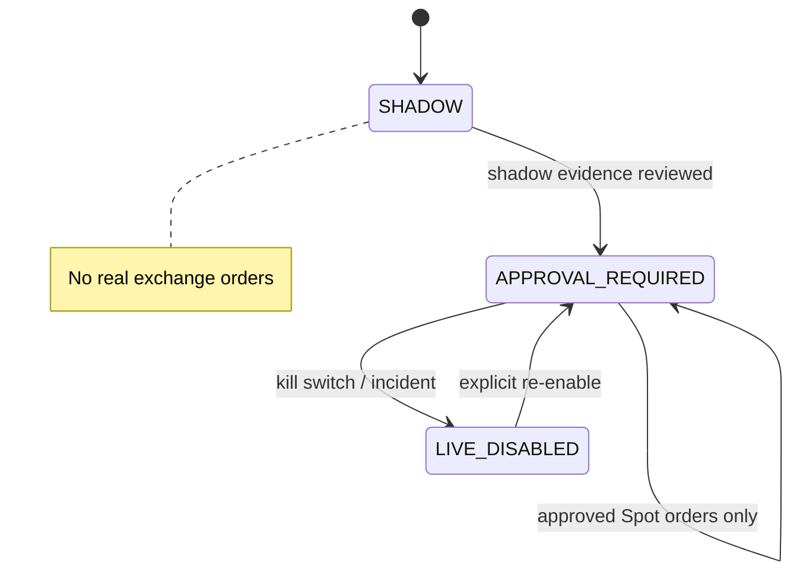
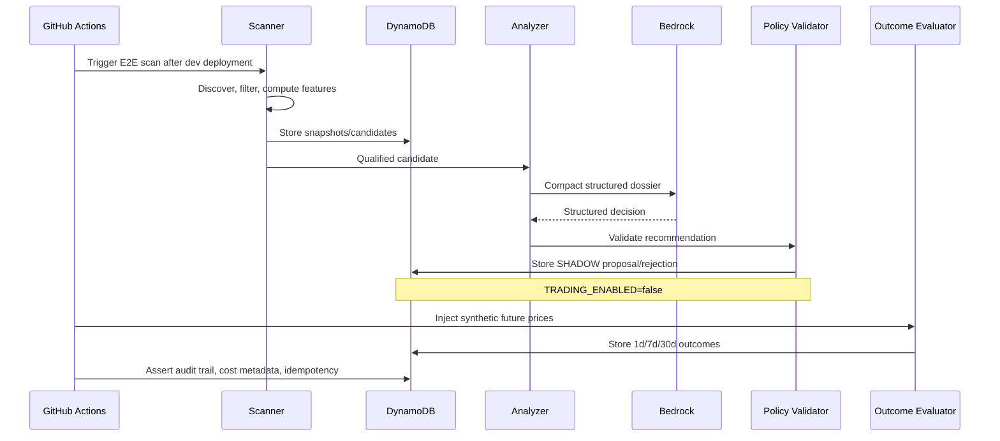

# Crypto Intelligence & Investment Decision Platform

Reference Architecture, Security Model, Implementation Plan & Test
Strategy — v1.0 Purpose: build a low-cost, AWS-native research and
decision platform that scans a broad crypto universe, uses deterministic
logic to reduce noise, invokes an LLM only for high-value analysis, and
keeps trade execution behind explicit policy validation and human
approval. Status: build-ready reference design. Initial operating mode
is SHADOW; no real orders are required to validate the platform.

## 1. Executive Architecture Decisions

| Decision               | v1 Choice                                | Rationale                                                                           |
|------------------------|------------------------------------------|-------------------------------------------------------------------------------------|
| Architecture           | Event-driven/serverless                  | Near-zero idle cost; simple operational model.                                      |
| Language               | Python 3.13                              | Strong AWS SDK and quantitative ecosystem; fast iteration.                          |
| Infrastructure as Code | Terraform                                | Portable, reviewable infrastructure and environment separation.                     |
| CI/CD                  | GitHub Actions + AWS OIDC                | Avoid CodeBuild/CodePipeline and long-lived AWS keys.                               |
| Compute                | AWS Lambda ZIP initially                 | Small dependency footprint; container image only if package complexity requires it. |
| LLM                    | Amazon Bedrock behind provider interface | Establish cost/performance baseline while keeping provider replaceable.             |
| LLM API                | Bedrock Converse + structured output     | Consistent model interface and schema-constrained responses.                        |
| State                  | DynamoDB                                 | Low-cost event/decision ledger and idempotency store.                               |
| Secrets                | AWS Secrets Manager                      | Centralized credentials with least-privilege IAM.                                   |
| Trading                | Binance Spot adapter                     | Market data first; execution disabled in shadow mode.                               |
| Discovery              | Dynamic Binance universe                 | Avoid hardcoding BTC/ETH/SOL and allow emerging-token discovery.                    |
| Execution policy       | Deterministic policy engine              | LLM recommends; code decides whether a recommendation is permissible.               |
| Initial safety mode    | SHADOW                                   | Collect evidence before any live execution.                                         |

## 2. Guiding Principles

- Deterministic before probabilistic: code calculates indicators,
  filters assets, enforces policy, sizes exposure, and validates orders.
- AI is an analyst, not the risk authority: the LLM receives compact
  evidence and returns a constrained recommendation.
- Discover broadly, execute narrowly: hundreds of assets may be scanned
  while only a small, policy-approved subset can become proposals.
- Every decision is replayable: store inputs, feature snapshot, policy
  version, prompt version, model, token usage, output, validation
  result, and outcome.
- Provider independence: Bedrock is v1, not an architectural dependency.
  The DecisionProvider interface enables future OpenAI/ChatGPT/MCP/other
  providers.
- No leverage in v1: Spot only; margin, futures, withdrawals, and
  autonomous execution remain disabled.
- Cost is a first-class metric: every AI call records token usage and
  estimated inference cost.

## 3. Logical Reference Architecture



## 4. Dynamic Asset Discovery

The scanner must not use a fixed three-coin allowlist for research. It
should discover the Binance Spot universe dynamically, then reduce it
through deterministic filters before any LLM call.

### 4.1 Discovery funnel



| Stage                             | Purpose                                                                                        | Example output             |
|-----------------------------------|------------------------------------------------------------------------------------------------|----------------------------|
| Universe                          | Load active Spot symbols for approved quote assets.                                            | Hundreds of symbols        |
| Eligibility                       | Exclude stablecoins, leveraged/synthetic products, insufficient history, unsupported metadata. | Smaller valid universe     |
| Liquidity                         | Minimum 24h quote volume, spread/order-book quality where available.                           | Liquid candidates          |
| Market quality                    | Reject pathological volatility/data gaps/manipulation-like conditions using explicit rules.    | Tradable research universe |
| Quantitative scan                 | Compute technical and relative-strength features.                                              | Ranked candidates          |
| Fundamental/tokenomics enrichment | Market cap, FDV, supply, unlocks, sector, protocol/on-chain data when provider is available.   | Candidate dossier          |
| Opportunity score                 | Combine market, liquidity, valuation/tokenomics, trend and risk signals.                       | Top N candidates           |
| LLM analysis                      | Analyze only the highest-value dossiers.                                                       | 0-5 calls per scan target  |
| Policy validation                 | Apply portfolio/risk constraints independently of LLM.                                         | Proposal or rejection      |

### 4.2 Initial configurable thresholds

```text
universe:
  quote_assets: [USDT]
  exclude_stablecoins: true
  exclude_leveraged_tokens: true
  minimum_trading_history_days: 90
  minimum_daily_quote_volume_usd: 5_000_000
  minimum_market_cap_usd: 50_000_000
  maximum_spread_pct: 0.50
```

```text
discovery:
  max_quant_candidates: 20
  max_enriched_candidates: 10
  max_llm_candidates_per_scan: 5
  new_listing_observation_days: 7
```

These values are starting hypotheses, not investment truths. They must
be configuration-driven, covered by tests, and tuned from observed
data/backtests.

### 4.3 New-listing path

Newly listed assets should be discovered immediately but handled by a
separate high-risk lifecycle: discovery -\> metadata/tokenomics -\>
liquidity observation -\> watchlist -\> periodic re-evaluation. A
listing event alone must never create a BUY proposal.

- Day 0: discover and record.
- Day 1-7: liquidity/volatility observation; no normal-strategy
  eligibility.
- Day 7/30/90: scheduled re-evaluation.
- Early promotion requires explicit high-risk policy and remains
  approval-only.

## 5. Deterministic Market & Opportunity Engine

### 5.1 Features calculated without an LLM

| Category               | Features                                                                              |
|------------------------|---------------------------------------------------------------------------------------|
| Price                  | 1h/4h/24h/7d returns; drawdown; distance from recent highs/lows.                      |
| Trend                  | EMA 20/50/200; trend regime; crossover state.                                         |
| Momentum               | RSI-14; MACD or equivalent momentum features.                                         |
| Volatility             | ATR%; rolling realized volatility; volatility regime.                                 |
| Volume/Liquidity       | Quote volume; volume ratio vs rolling baseline; spread/depth when available.          |
| Relative strength      | Asset return vs BTC and/or broad eligible-universe benchmark.                         |
| Portfolio              | Current weight; target band; available reserve; concentration.                        |
| Fundamental/tokenomics | Market cap; FDV; circulating ratio; unlock/emission indicators when sourced.          |
| Risk                   | Data quality, extreme volatility, insufficient liquidity, listing age, concentration. |

### 5.2 Scoring model

Use transparent component scores rather than a single opaque heuristic.
Suggested normalized scores are 0-100:

```text
opportunity_score =
    0.20 * liquidity_score +
    0.20 * momentum_score +
    0.15 * trend_score +
    0.15 * relative_strength_score +
    0.15 * fundamental_tokenomics_score +
    0.15 * portfolio_fit_score -
    risk_penalty
```

The exact weights live in policy/configuration and are versioned.
Missing fundamental data must lower confidence or prevent escalation
rather than being silently treated as positive.

### 5.3 LLM gate

```text
score < 50      -> record only
50 <= score <70 -> watchlist
70 <= score <85 -> LLM analysis if call budget available
score >= 85     -> priority LLM analysis
```

The gate must also enforce daily/monthly LLM call budgets and candidate
deduplication so repeated scans do not analyze materially unchanged
dossiers.

## 6. LLM Decision Layer

### 6.1 Provider interface

```text
class DecisionProvider(Protocol):
    def analyze(
        self,
        dossier: CandidateDossier,
        portfolio: PortfolioSnapshot,
        policy: InvestmentPolicy,
    ) -> InvestmentDecision:
        ...
```

- `OpenAIProvider` is the v1 implementation (ADR-0011). `BedrockProvider` is a later adapter behind the same contract.
- Future providers can implement the same contract without changing
  discovery, policy, ledger, or execution.
- Model IDs and routing thresholds are configuration, not business
  logic.

### 6.2 Prompt design

The prompt must contain derived facts, not raw candle history. Target a
compact dossier that is stable enough to replay and compare across model
providers.

```text
ROLE:
You are a crypto research analyst. Evaluate only the supplied evidence.
Do not invent missing facts. Do not override investment policy.
```

```text
TASK:
Assess whether the candidate merits a proposal, watchlist status, or rejection.
Challenge the bullish thesis and identify material downside.
```

```text
INPUT:
- market features
- liquidity features
- tokenomics/fundamentals
- portfolio context
- deterministic signal reasons
- explicit missing-data flags
```

```text
OUTPUT:
Strict InvestmentDecision JSON schema only.
```

### 6.3 Structured response contract

```text
{
  "decision": "BUY | WATCH | REJECT",
  "asset": "string",
  "confidence": 0.0,
  "suggested_amount_usd": 0.0,
  "thesis": ["..."],
  "risks": ["..."],
  "missing_evidence": ["..."],
  "invalidation": {
    "condition": "...",
    "value": "..."
  }
}
```

Use Bedrock structured outputs where supported, then still validate the
response locally with Pydantic. Schema compliance is necessary but not
sufficient for trade authorization.

### 6.4 Routing

Do not introduce Bedrock Intelligent Prompt Routing in v1. Start with
one low-cost model. Add a stronger model only after telemetry
demonstrates a reason to escalate.



## 7. Investment Policy & Risk Controls



```text
portfolio:
  core_assets: [BTCUSDT, ETHUSDT]
  discovery_max_portfolio_pct: 0.10
```

```text
trading:
  spot_only: true
  margin_enabled: false
  futures_enabled: false
  leverage_enabled: false
  withdrawals_enabled: false
```

```text
risk:
  max_trade_usd: 75
  max_trade_portfolio_pct: 0.05
  minimum_cash_reserve_pct: 0.20
  max_discovery_asset_pct: 0.01
  max_daily_trade_usd: 150
  max_monthly_trade_usd: 750
```

```text
ai:
  max_calls_per_day: 10
  max_calls_per_month: 150
```

```text
execution:
  mode: SHADOW
  human_approval_required: true
```

The figures above are illustrative defaults for engineering and testing.
They are configuration values to be reviewed before live use.

### 7.1 Non-negotiable validator checks

- Asset is eligible and currently tradable.
- Market data is fresh and complete.
- Proposal schema and prompt/policy versions are known.
- Suggested amount is within per-trade, daily, monthly and portfolio
  limits.
- Cash reserve remains above minimum after the hypothetical trade.
- Discovery-token concentration remains within its cap.
- Spot-only; no leverage/margin/futures path exists.
- Duplicate/idempotent order key has not already executed.
- Human approval is present and unexpired in APPROVAL_REQUIRED mode.
- Kill switch is not active.
- Portfolio is re-read immediately before execution; stale approvals are
  rejected.

## 8. AWS Implementation

| Service                       | Responsibility                                         | Cost posture                                                            |
|-------------------------------|--------------------------------------------------------|-------------------------------------------------------------------------|
| EventBridge Scheduler         | Periodic scans and outcome evaluation.                 | Low frequency; no always-on compute.                                    |
| Lambda                        | Scanner, analyzer, outcome evaluator, future executor. | ZIP first; short functions; reserved concurrency unnecessary initially. |
| DynamoDB                      | Decision/event ledger and state.                       | On-demand capacity initially.                                           |
| Secrets Manager               | Binance credentials.                                   | Only production has trading credentials.                                |
| Bedrock Runtime               | LLM inference.                                         | Calls only after deterministic gate.                                    |
| CloudWatch                    | Logs, metrics, alarms.                                 | Structured logs; short retention in dev.                                |
| SSM Parameter Store/AppConfig | Non-secret flags such as TRADING_ENABLED.              | Kill switch without code redeploy.                                      |
| S3 (optional)                 | Large historical/backtest datasets if needed.          | Add only when DynamoDB/event records are insufficient.                  |

### 8.1 Lambda packaging

Start with ZIP. AWS currently limits Lambda deployment packages to 250
MB uncompressed; container images can be up to 10 GB. Move to a
container only if native/quant dependencies justify the operational
overhead.

- Prefer boto3, httpx, pydantic, numpy and small indicator utilities.
- Avoid pandas unless analysis genuinely benefits from it.
- Separate handlers from domain logic so most tests run without Lambda.
- Use timeouts/retries with jitter for exchange/network calls.
- Set explicit Lambda reserved concurrency only if later needed to
  prevent accidental fan-out.

### 8.2 Secrets and IAM

- GitHub Actions authenticates to AWS with OIDC and short-lived
  credentials; no AWS access keys in GitHub.
- Scanner Lambda needs no Binance trading secret if public endpoints are
  sufficient.
- Analyzer Lambda receives only Bedrock permissions and state access
  required for its role.
- Executor Lambda alone receives GetSecretValue for the exact Binance
  trading-secret ARN.
- No Lambda role receives broad secretsmanager:\* or bedrock:\*
  permissions.
- Production secret must use an exchange key with withdrawals disabled
  and the narrowest available trading permissions.

## 9. DynamoDB Decision Ledger

### 9.1 Recommended event model

Prefer an append-oriented ledger. Derived/current state may be
materialized separately, but raw decisions should remain immutable for
replay.

```text
PK: ASSET#BTCUSDT
SK: EVENT#2026-10-03T16:00:00Z#<uuid>
```

```text
event_type
market_snapshot
feature_set
opportunity_score
signal_reasons
data_quality_flags
```

```text
policy_version
prompt_version
provider
model_id
llm_invoked
input_tokens
output_tokens
estimated_llm_cost_usd
```

```text
llm_decision
validator_result
approval
execution
```

```text
benchmark_price
outcome_1d
outcome_7d
outcome_30d
```

```text
correlation_id
idempotency_key
created_at
ttl   # only for disposable telemetry, never required audit records
```

### 9.2 Cost/performance telemetry

- Number of assets scanned.
- Number rejected by each funnel stage.
- Number of LLM calls and skip rate.
- Input/output tokens and estimated cost per decision.
- Latency per stage.
- BUY/WATCH/REJECT distribution.
- Human approval/rejection rate.
- Hypothetical/live performance at 1d, 7d and 30d.
- Comparison against fixed BTC DCA and a fixed BTC/ETH allocation
  benchmark.
- Maximum drawdown, turnover, fees and slippage once live execution
  exists.

## 10. Repository Structure

```text
crypto-intelligence-platform/
├── README.md
├── pyproject.toml
├── uv.lock
├── Makefile
├── src/
│   ├── adapters/
│   │   ├── binance_market.py
│   │   ├── binance_trading.py
│   │   ├── bedrock.py
│   │   └── fundamentals.py
│   ├── domain/
│   │   ├── models.py
│   │   ├── policy.py
│   │   └── errors.py
│   ├── discovery/
│   │   ├── universe.py
│   │   ├── eligibility.py
│   │   ├── liquidity.py
│   │   └── new_listings.py
│   ├── features/
│   │   ├── indicators.py
│   │   ├── market_features.py
│   │   └── tokenomics.py
│   ├── scoring/
│   │   ├── opportunity.py
│   │   └── risk.py
│   ├── ai/
│   │   ├── provider.py
│   │   ├── prompts.py
│   │   ├── schemas.py
│   │   └── routing.py
│   ├── portfolio/
│   │   ├── allocation.py
│   │   └── validator.py
│   ├── execution/
│   │   ├── proposals.py
│   │   ├── approvals.py
│   │   └── executor.py
│   ├── persistence/
│   │   └── ledger.py
│   └── handlers/
│       ├── scanner.py
│       ├── analyzer.py
│       ├── outcome_evaluator.py
│       └── executor.py
├── policies/
│   └── investment-policy.yaml
├── prompts/
│   └── candidate-analysis-v1.md
├── tests/
│   ├── unit/
│   ├── contract/
│   ├── integration/
│   ├── e2e/
│   ├── backtest/
│   └── fixtures/
├── terraform/
│   ├── modules/
│   └── environments/
│       ├── dev/
│       └── prod/
└── .github/workflows/
    ├── pull-request.yml
    ├── deploy-dev.yml
    └── deploy-prod.yml
```

## 11. CI/CD with GitHub Actions

### 11.1 Pull request

- ruff format/check and import validation.
- mypy/pyright static typing.
- pytest unit + contract tests with coverage threshold.
- dependency/security scan.
- terraform fmt -check, validate and static security checks.
- terraform plan for dev; attach plan to workflow summary.

### 11.2 Deploy dev

- Trigger on merge to main.
- Assume dev deployment role through GitHub OIDC.
- Build deterministic ZIP artifact with dependency lock.
- terraform apply.
- Run integration tests against deployed dev resources.
- Run E2E shadow smoke test using fixture/sandbox market adapter; no
  trading credentials.

### 11.3 Deploy production

- Use GitHub Environment protection/manual approval.
- Assume a separate production role with narrower trust conditions.
- Apply immutable/versioned Lambda artifact.
- Run post-deploy health check.
- TRADING_ENABLED remains false until separately enabled by the owner.

## 12. Testing Strategy

### 12.1 Unit tests

| Area                 | Required tests                                                                                                  |
|----------------------|-----------------------------------------------------------------------------------------------------------------|
| Indicators           | Known candle fixtures produce expected RSI/EMA/ATR/returns within tolerance; missing/NaN/short history handled. |
| Eligibility          | Stablecoin/leveraged token/history/volume/spread exclusions; boundary values.                                   |
| Universe             | Duplicate symbols, delistings, quote-asset filters, metadata changes.                                           |
| Scoring              | Each component score; weight math; penalties; missing-data behavior; score boundaries 49/50/69/70/84/85.        |
| LLM gate             | No call below threshold; budgets; unchanged-candidate deduplication; daily/monthly counters.                    |
| Prompt builder       | Stable prompt version; compact dossier; no secret leakage; missing evidence explicit.                           |
| Schema               | Valid structured decision accepted; malformed/unknown enum/extra fields rejected.                               |
| Policy validator     | Trade amount, concentration, reserve, daily/monthly limits, asset eligibility, stale data, kill switch.         |
| Idempotency          | Same proposal/order key cannot execute twice, including retry/race simulation.                                  |
| Ledger               | Immutable event write; correlation IDs; token/cost fields; serialization round-trip.                            |
| Secrets              | Only executor adapter attempts secret retrieval; secret never appears in logs/exceptions.                       |
| Provider abstraction | Bedrock mock conforms to DecisionProvider; provider swap does not affect domain tests.                          |
| New listings         | Observation period enforced; listing never directly becomes executable proposal.                                |
| Outcome evaluator    | Correct 1d/7d/30d return calculations and benchmark comparison.                                                 |

Target \>=90% branch coverage for policy, scoring, idempotency and
execution-validator modules. Overall repository coverage may be lower
where adapters are covered primarily by contract/integration tests.

### 12.2 Property and boundary tests

- For any proposal, increasing trade amount beyond a configured cap can
  never turn a rejection into approval.
- If TRADING_ENABLED=false, no possible input can reach the exchange
  order method.
- If execution mode is SHADOW, no possible input can call the live order
  endpoint.
- Unknown assets cannot be executed.
- Stale market/portfolio state cannot be executed.
- Portfolio reserve after an approved trade must remain \>= configured
  minimum.
- A duplicate idempotency key produces at most one execution record.

### 12.3 Contract tests

- Binance market adapter against recorded sanitized API responses;
  validate symbol metadata and candle mapping.
- Bedrock provider against a stubbed Converse response and JSON schema.
- DynamoDB repository using an isolated test table/local emulator where
  practical.
- Secrets Manager adapter verifies expected secret shape without using
  production credentials.
- Fundamental-data providers each implement a common contract and
  explicit missing-data semantics.

### 12.4 Integration tests in AWS dev

1.  Deploy dev stack using GitHub Actions.
2.  Invoke scanner with a fixed fixture universe and deterministic
    clock.
3.  Verify DynamoDB snapshot/candidate records.
4.  Force one candidate below and one above the LLM threshold.
5.  Verify below-threshold candidate never invokes Bedrock.
6.  Invoke analyzer with Bedrock mocked/stubbed where deterministic CI
    behavior is required.
7.  Validate structured response -\> policy validator -\> SHADOW
    proposal.
8.  Verify CloudWatch metrics/log fields contain correlation IDs and no
    secrets.
9.  Verify IAM negative tests: scanner cannot read trading secret;
    analyzer cannot place an order.

## 13. Full End-to-End Test



The primary E2E test proves the entire production-shaped path while
guaranteeing that no real order can be submitted.

### 13.1 E2E environment

- Dedicated dev stack and DynamoDB table.
- EXECUTION_MODE=SHADOW and TRADING_ENABLED=false.
- No production Binance trading secret attached to any dev role.
- Market adapter may use live public Binance data for one smoke path and
  deterministic fixtures for repeatable CI.
- Bedrock may be invoked for the cost/contract smoke path; a stub mode
  is retained for deterministic regression tests.

### 13.2 E2E scenario

1.  GitHub Actions authenticates to AWS through OIDC and deploys the dev
    stack.
2.  Test triggers the scanner with a correlation ID and deterministic
    test policy.
3.  Universe discovery loads symbols and applies eligibility/liquidity
    rules.
4.  Feature engine computes indicators and writes the market snapshot.
5.  Fixture ensures at least one candidate crosses the LLM threshold.
6.  Analyzer builds the compact dossier and invokes the configured
    Bedrock model using structured output.
7.  Response is validated by Pydantic and passed to the deterministic
    policy validator.
8.  Validator creates a SHADOW proposal or rejection; it cannot call
    live execution.
9.  Ledger contains scan, candidate, AI usage, policy decision and
    shadow proposal events linked by correlation ID.
10. Outcome evaluator is invoked with synthetic future prices and writes
    benchmark/return results.
11. Assertions verify token counts/cost metadata, no secret values in
    logs, and zero live exchange-order calls.

### 13.3 E2E acceptance criteria

| Criterion           | Pass condition                                                               |
|---------------------|------------------------------------------------------------------------------|
| Safety              | Zero live orders; executor role/secret unavailable in dev.                   |
| Discovery           | Dynamic universe is processed and exclusions are explainable.                |
| LLM efficiency      | Only threshold-qualified candidates invoke Bedrock.                          |
| Structured output   | Response conforms to schema and local validation.                            |
| Policy independence | An intentionally oversized LLM proposal is rejected by deterministic policy. |
| Auditability        | One correlation ID reconstructs the full scan-to-decision path.              |
| Idempotency         | Replaying the same event creates no duplicate proposal/execution.            |
| Cost telemetry      | Model ID, input/output usage and estimated cost are persisted.               |
| Observability       | Expected metrics emitted; no secrets or full credentials in logs.            |
| Benchmarking        | Synthetic 1d/7d/30d outcome and benchmark records are produced.              |

## 14. Backtesting & Shadow Evaluation

Backtesting should validate the deterministic funnel and risk policy,
not claim that historical performance guarantees future returns.

- Replay historical candles through exactly the same feature/scoring
  code used in production.
- Prevent look-ahead bias: only data available at each simulated
  timestamp may be used.
- Include realistic fees/slippage assumptions when evaluating
  hypothetical trades.
- Record how often the LLM would have been invoked; estimate historical
  inference cost.
- Compare against fixed BTC DCA and fixed BTC/ETH allocation benchmarks.
- Track return, maximum drawdown, turnover, hit rate, average gain/loss,
  fees and exposure.
- Shadow mode should run at least 30 days before enabling approval-based
  live execution; longer observation is preferable for meaningful
  evidence.

## 15. Observability & Cost Controls

### 15.1 Metrics

```text
CryptoAgent/Scans
CryptoAgent/AssetsDiscovered
CryptoAgent/AssetsEligible
CryptoAgent/Candidates
CryptoAgent/LLMCalls
CryptoAgent/LLMSkipped
CryptoAgent/LLMInputTokens
CryptoAgent/LLMOutputTokens
CryptoAgent/EstimatedLLMCostUSD
CryptoAgent/PolicyRejected
CryptoAgent/ShadowProposals
CryptoAgent/ExecutionAttempts
CryptoAgent/ExecutionFailures
```

### 15.2 Alarms

- Scanner/analyzer Lambda errors or repeated timeouts.
- No successful scan within expected schedule window.
- LLM calls exceed expected daily threshold.
- Unexpected ExecutionAttempts while SHADOW or TRADING_ENABLED=false:
  critical alarm.
- DynamoDB throttling or persistence failures.
- Estimated monthly AI cost crosses warning threshold.

### 15.3 Application-level cost guardrails

- Hard max LLM calls/day and calls/month.
- Max candidates per scan.
- Do not resend raw historical candles to the LLM.
- Cache/reuse unchanged candidate dossiers for a configurable TTL.
- Store exact usage returned by provider and estimate cost by
  model/version.
- AWS Budget is an alerting control; application call limits are the
  effective hard guardrail.

## 16. Security Threat Model

| Threat                              | Control                                                                                                          |
|-------------------------------------|------------------------------------------------------------------------------------------------------------------|
| Compromised GitHub workflow         | OIDC trust restricted to repo/environment/branch; protected production environment; least-privilege deploy role. |
| Secret leakage                      | Secrets Manager; executor-only access; structured log redaction; never place secrets in prompts.                 |
| Prompt injection from external text | Treat news/project text as untrusted data; no LLM tool permission to trade; deterministic policy after model.    |
| Hallucinated asset/fact             | Only known candidate IDs and supplied evidence accepted; missing evidence explicit; schema + local validation.   |
| Model proposes unsafe size          | Deterministic caps and portfolio revalidation.                                                                   |
| Duplicate/retried event             | Idempotency key and conditional DynamoDB writes.                                                                 |
| Stale approval                      | Approval TTL and portfolio/market revalidation before order.                                                     |
| Exchange key compromise             | Withdrawals disabled; narrow permissions; rotation; separate prod secret.                                        |
| Runaway inference                   | Call quotas, candidate caps, alarms, kill switch.                                                                |
| Supply-chain compromise             | Pinned dependencies, dependency scanning, reproducible build artifact.                                           |

## 17. Implementation Plan

| Milestone                      | Scope                                                                        | Exit criteria                                                                    |
|--------------------------------|------------------------------------------------------------------------------|----------------------------------------------------------------------------------|
| M0 - Repository & ADRs         | Repo, coding standards, architecture decision records, policy placeholders.  | PR checks green; no AWS resources yet.                                           |
| M1 - AWS foundation            | Terraform, GitHub OIDC, Lambda skeletons, DynamoDB, scheduler, IAM, logging. | Dev deploy via GHA; IAM negative tests pass.                                     |
| M2 - Discovery & quant engine  | Dynamic universe, filters, indicators, scoring, new-listing watcher, ledger. | Broad universe produces ranked candidates without LLM.                           |
| M3 - Bedrock decision layer    | Provider interface, structured prompt/schema, cost telemetry, LLM gate.      | Only qualified candidates invoke Bedrock; replayable decisions stored.           |
| M4 - Shadow portfolio          | Shadow proposals, benchmarks, outcome evaluator, backtest harness.           | 30-day-ready shadow system; zero live execution capability in dev.               |
| M5 - Approval workflow         | Proposal notification, signed/expiring approval, revalidation.               | Approved/rejected decisions fully audited; still safe to keep executor disabled. |
| M6 - Live Spot executor        | Binance trade secret, idempotent executor, tiny limits, kill switch.         | First intentionally tiny approved Spot order can execute once and be audited.    |
| M7 - Model/provider comparison | Alternative provider adapter and experiment reporting.                       | Cost/quality comparison against Bedrock baseline without core redesign.          |

## 18. Coding-Agent Work Packages

Give Cursor or Claude Code one milestone at a time. Each task must
include interfaces, acceptance tests and explicit prohibitions.

### Example M2 instruction

```text
Implement M2 only.
```

```text
Requirements:
- Dynamic Binance Spot universe; no fixed three-token research allowlist.
- Domain logic must be pure Python and independent of Lambda handlers.
- Implement eligibility, liquidity, feature calculation and opportunity scoring.
- Configuration comes from versioned policy YAML.
- No Bedrock calls.
- No trading/order code.
- Add unit tests for boundaries and malformed/missing market data.
- Add fixture-driven integration test.
- Do not change Terraform outside resources explicitly required by M2.
- Update architecture decision record for any design deviation.
- All tests, linting and typing must pass before completion.
```

This prevents an AI coding tool from silently expanding scope or
inventing risk policy.

## 19. Definition of Done for v1

- A scheduled scan dynamically discovers and filters the Binance Spot
  universe.
- Deterministic features and opportunity scores are reproducible from
  stored inputs.
- Only qualified candidates invoke Bedrock.
- Bedrock output is schema-constrained and locally validated.
- Investment policy independently rejects unsafe or invalid
  recommendations.
- All decisions are reconstructable from the ledger.
- Shadow-mode E2E test passes with zero possible live-order path in dev.
- CI/CD uses GitHub OIDC; no long-lived AWS credentials.
- Secrets are isolated and never logged or sent to the LLM.
- Cost metrics establish a Bedrock baseline suitable for later provider
  comparison.
- Core policy/scoring/execution-validation modules meet the defined
  branch-coverage target.
- Production execution remains disabled until shadow evidence is
  reviewed.

## 20. Current Platform Facts Used by This Design

The implementation should re-check service/model availability at build
time because cloud capabilities and model catalogs change.

- Amazon Bedrock Converse provides a consistent message interface across
  supported models; structured outputs can constrain supported model
  responses to a JSON schema.
- GitHub Actions OIDC can authenticate to AWS without storing long-lived
  AWS access keys; AWS trust conditions should restrict which
  repository/workflow context may assume the role.
- AWS Lambda currently supports ZIP packages up to 250 MB uncompressed
  and container images up to 10 GB uncompressed.
- Bedrock model pricing is usage-based and model-specific; therefore the
  ledger stores usage and cost rather than assuming a fixed monthly
  model cost.

## 21. Build Start Checklist

- Create private GitHub repository.
- Bootstrap pyproject/uv, lint/type/test configuration and Makefile.
- Write ADR-001: deterministic risk authority; LLM recommendation only.
- Write ADR-002: dynamic research universe; narrow execution policy.
- Create dev Terraform backend/state strategy.
- Create GitHub OIDC provider/roles and environment protection.
- Deploy M1.
- Implement M2 with recorded fixtures before any Bedrock integration.
- Review Investment Policy v1 and scoring weights.
- Implement M3 and begin cost telemetry.
- Run shadow E2E and backtest/replay suite.
- Keep production TRADING_ENABLED=false until shadow results are
  deliberately reviewed.
