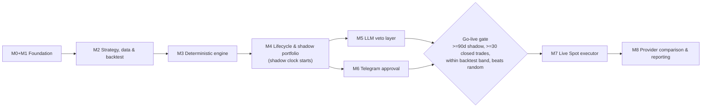

# Crypto Intelligence Platform - Implementation Roadmap (to-do)

**Date:** 2026-10-03
**Updated:** 2026-10-04 — Alpha Pilot timeline, evaluation cohorts, M3 Decision Evaluation Dataset, M4 Engine Assurance Scorecard. M2 stays closed.
**Inputs:** `docs/architecture/reference-architecture-v1.0.md`, `docs/reviews/2026-10-03-gap-analysis.md`
**Owner decisions:** us-east-1 · single AWS account (`258485600712`, profile `soworks`) · Telegram approvals · Binance.com venue (owner in Colombia)

Each milestone becomes its own detailed, test-driven plan (`docs/plans/<date>-<milestone>.md`)
written just before it starts, so it can account for what the previous milestone
learned. Only Phase 1 (M0 + M1) is detailed now:
[`2026-10-03-phase1-foundation.md`](2026-10-03-phase1-foundation.md).

## What changed from the reference doc's M0-M7

| Reference doc | This roadmap | Why |
|---|---|---|
| M2 Discovery & quant engine | **M2 Strategy, data & backtest foundation**, then **M3 Deterministic engine** | Edge must be specified and validated on survivorship-free history before scoring code is written (B1, B5, B11). |
| M3 Bedrock decision layer | **M5 LLM veto layer** | LLM is veto/explain only and evaluated against a running deterministic shadow baseline (B12). |
| M4 Shadow portfolio | **M4 Position lifecycle & shadow portfolio** | Adds exits, sizing, regime, core DCA, benchmarks; shadow clock starts here (B2-B4, B8, B9, B11). |
| M5 Approval workflow | **M6 Telegram approval** | Approves whole trade plans with pre-authorized exits (A8, B3, B14). |
| M6 Live Spot executor | **M7 Live Spot executor** | Adds static egress, symbol filters, tax-grade fills, custody caps (A2, B10, B13). |
| M7 Provider comparison | **M8 Provider comparison & reporting** | Unchanged intent, plus tax export. |

## Dependency view



The October Alpha Pilot is a calendar window inside M3/M4 validation. It is not a milestone, and it does not sit in front of the go-live gate.

---

## Alpha Pilot and engine assurance  *(owner decision 2026-10-04)*

**Timeline and capital**
- Now through 2026-10-18: Alpha development and validation.
- 2026-10-19 through 2026-10-31: Alpha Pilot with up to $500 USD of separately identified pilot capital.
- October capital is the `ALPHA_PILOT_2026_10` cohort. It is not the normal monthly investment budget.
- From 2026-11-01: the normal strategy budget is $800 USD/month, available from the 1st, consistent with the existing policy.
- The engine is not required to deploy the available budget. Cash, and no BUY, is a valid outcome when the deterministic rules find no qualifying opportunity.
- After the Coinbase → Binance consolidation, the owner supplies the definitive portfolio inventory. That inventory is the portfolio genesis snapshot and replaces the approximate holdings input.

**Safety boundary**
- Do not move M7 or live execution earlier to support the October pilot.
- Any real October purchase is executed manually by the owner after reviewing a CIP recommendation.
- Where the platform can record it, that purchase is a manual pilot execution on the pilot cohort. It is not a live order from the executor.
- SHADOW remains the default. The go-live gate below stays ≥90 days of prod shadow and ≥30 closed shadow trades, plus the existing band, random-baseline, and LLM-ablation checks.

**Evaluation cohorts**
Results from different phases stay separate. The progression is `BACKTEST` → `ALPHA_PILOT_2026_10` → `SHADOW` → `LIVE`. The exact schema is chosen in the M3 plan. Do not add lifecycle machinery only to carry the label.

**October assurance**
The Oct 19–31 pilot is not a profitability test. Thirteen days is not evidence to optimize or reject the strategy. P&L, hit rate, and excess return are recorded and are not October pass/fail thresholds.

Primary assurance for the pilot:
- deterministic decisions are reproducible from persisted inputs
- zero policy or risk violations
- zero look-ahead or data leakage
- no BUY from stale or invalid required inputs
- recommendation and rejection reasons, with their evidence, are persisted
- candidate outcomes can be evaluated afterward
- manual pilot executions can be reconciled where the platform records them
- critical operational defects found during the pilot are filed as issues

**Longer horizon**
Evidence accumulates at 30, 60, and 90 days. The go-live gate remains the authority for live trading. Do not tune M3 parameters from a handful of October trades. A change prompted by the pilot is versioned, so the pre-change and post-change cohorts stay distinguishable.

---

## M0 + M1 - Foundation  *(detailed plan ready)*

Plan: [`2026-10-03-phase1-foundation.md`](2026-10-03-phase1-foundation.md)

- [x] Toolchain: uv, ruff, mypy (strict), pytest + hypothesis + moto, pre-commit, Makefile
- [x] Binance/Bedrock reachability spike from Lambda in us-east-1 and sa-east-1 → ADR-0003
- [x] ADRs 0001-0007 (risk authority, universe, region/gateway, account isolation, storage, orchestration, package layout)
- [x] Versioned, fail-closed investment policy loader (fractions vs bps units fixed)
- [x] SSM execution flags read fail-closed (`EXECUTION_MODE`, `TRADING_ENABLED`, `KILL_SWITCH`)
- [x] Append-only ledger model + repository (GSI by correlation ID and by type/day)
- [x] Terraform bootstrap: state bucket (native lockfile), GitHub OIDC, plan/dev/prod roles, per-env permission boundaries, budget, CloudTrail
- [x] GitHub: environments, variables, branch protection (resolve private-repo plan limits)
- [x] Dev stack: S3 data bucket, ledger/state/counters tables, SSM flags, SNS alerts, Step Functions skeleton pipeline, hourly schedule, alarms
- [x] CI: PR checks (lint/type/test/audit, fmt/tflint/checkov, dev plan) and deploy-dev with integration + IAM negative tests

**Exit:** dev deploys via OIDC; pipeline writes SCAN_STARTED/SCAN_COMPLETED in SHADOW; IAM negative tests pass; budget/CloudTrail/alarms live.

---

## M2 - Strategy, data & backtest foundation

**Decisions first**
- [x] ADR-0010 Strategy spec: hypothesis, daily 00:00 UTC timeframe, 2-8 week holds, kill criteria (B1). ADR-0008 is the Terraform-modules decision, so the strategy spec is 0010.
- [x] ADR-0009 Venue & jurisdiction: Binance.com, `execution_venue` config, tax residency, fee schedule used in simulations (B13)
- [x] Owner inputs recorded in policy: starting portfolio value, monthly contribution, core vs discovery budgets (B8, B9)
- [x] Policy schema v2: universe thresholds and exclusions (B6), fundamentals gates (B7), regime block (B4), sizing/limits/circuit breakers (B8), exits (B2), approval TTL/drift (B14). Values live in `hypotheses` and fail closed. The Phase 1 `universe` and `risk` placeholders stay separate. M2 does not implement the engines that consume these values.

**Exchange access**
- [x] `BinanceMarketAdapter` protocol + HTTP implementation with configurable base URL (`https://data-api.binance.vision` in AWS per ADR-0003), central weight-aware rate limiter, 429 backoff, hard stop on 418 (A1, A11)
- [x] Smoke test in dev that the market-data adapter reaches `data-api.binance.vision` from Lambda; alarm if it starts returning 451
- [x] Recorded, sanitized contract fixtures for `exchangeInfo`, `ticker/24hr`, `klines`, `depth`

**Point-in-time history**
- [x] Ingest Binance public data dumps (`data.binance.vision`) daily klines for all USDT pairs **including delisted** into S3 (Parquet) (A4, B11)
- [x] Point-in-time universe table: listing/delisting dates, status changes, monitoring/seed tags, migrations/redenominations (MATIC→POL, FTM→S, 1000x tickers) with continuity stitching (B6)
- [x] Verify delisted coverage (LUNA 2022-05, FTT 2022-11, 2023-25 delisting waves) with tests
- [x] Forward recorders (B4, B5): CoinGecko BTC dominance and DefiLlama stablecoin supply (`market_regime`, daily is enough), Binance futures funding and open interest (`derivatives_positioning`, hourly), spot spread and depth (`execution_liquidity`, each scan). Append-only JSON under `observations/` in the dev data bucket. A failed fetch is an `observation-failures/` record and is not a bar. Open interest stays in the Binance base-asset quantity; notional OI is derived later from the point-in-time price. Depth uses policy `recorders.depth_band_bps` (200, ±2% of mid). `rate(1 hour)` invokes `cip.handlers.recorders.record` for BTCUSDT and ETHUSDT. Futures calls use public `fapi.binance.com`; a 451 is a failure, not a fill. The local command remains `python -m cip.recorders run --output DIR`.

**Backtest harness**
- [x] BTC DCA and BTC/ETH DCA with identical cash flows, fee-only fills, and portfolio metrics (excess, IRR/TWR, Sharpe/Sortino, max DD, Calmar, beta/alpha, fee drag). Run metadata records policy version, data window, git SHA, benchmark, seed, fee/spread/slippage assumptions, and holdings source (`FIXTURE` or `OWNER_INVENTORY`).
- [x] Replay contracts (`FeatureCalculator`, `Eligibility`, `Scorer`, `Sizer`, `ExitRules`) so M3/M4 write the rules once. The simulator supplies time and market state. It must not grow a second copy of those rules.

The event-driven simulator, equal-weight and random baselines, and trade-level metrics are M3/M4 work. They are listed there, not left here as unfinished M2.

**Exit:** met for M2. Strategy and venue ADRs accepted. Survivorship-free kline ingest is in place (verification set in the dev bucket; a full USDT catalog sync is an operator run). BTC and BTC/ETH DCA replay from one command. Forward collection has started: the hourly recorder writes observations to the dev data bucket, and a failed fetch is a failure record rather than a bar. No scoring, eligibility, sizing, or exit implementation. The simulator, random baseline, and trade-level metrics are M3/M4.

---

## M3 - Deterministic engine (no LLM)

- [ ] Universe discovery from `exchangeInfo` + per-scan snapshot to S3; ledger references snapshot key + SHA-256 (A4)
- [ ] Eligibility gates (normal and high-risk lanes) and complete exclusion lists (stablecoins, wrapped/LST, fan tokens, non-TRADING, monitoring tag, delisting, suspended deposits/withdrawals, migrations) (B6)
- [ ] Liquidity gates on 30-day medians; spread/depth from snapshots (B6)
- [ ] Manipulation heuristics → `manipulation_suspect` with 7-day escalation block (B6)
- [ ] Fundamentals adapters (CoinGecko Demo primary, CMC cross-check, DefiLlama) with explicit missing-data semantics and verified asset↔CoinGecko ID map (B7)
- [ ] Regime classifier with hysteresis; per-regime discovery policy (B4)
- [ ] Features on daily candles: returns vs BTC (30/90d, skip recent), EMA/ATR/RSI, extension metrics, beta/correlation to BTC, taker-buy ratio, trade-count stats (B5)
- [ ] Score v2 (trend/RS + extension penalty + small tokenomics component); liquidity and portfolio fit removed from the score (B5)
- [ ] Information-coefficient study per component and regime on the M2 dataset; freeze weights in policy (B5)
- [ ] New-listing lane: 90 days to high-risk lane, 200 days to normal lane; listing never creates BUY (B6)
- [ ] Step Functions pipeline v2: Discover → Gates → Features (Map over batches) → Regime → Score → Record; switch schedule to daily after 00:00 UTC close (A3, B5)
- [ ] Funnel telemetry metrics per stage (reference §9.2, §15.1)
- [ ] Event-driven daily simulator using the M3 feature, eligibility, and scoring contracts and the M4 exit contract; next-bar fills; venue fees + spread + slippage; walk-forward splits (B11). Moved from M2. Do not add a second implementation of those rules.
- [ ] Equal-weight eligible-universe benchmark and a 1,000-run random-selection baseline with a persisted seed (B11). Moved from M2. Both depend on point-in-time eligibility.
- [ ] Evaluation cohort on each persisted decision (`BACKTEST`, `ALPHA_PILOT_2026_10`, `SHADOW`, `LIVE`). Schema is part of the M3 plan. Pilot capital stays distinct from the $800 monthly budget.
- [ ] Decision Evaluation Dataset, built with the deterministic engine and in place before 2026-10-19. For every evaluated candidate, including rejections, persist the cohort, symbol, evaluation timestamp, eligibility or rejection with reason codes, feature values, score and score components, ranking, market regime, policy/config version, source and data timestamps with provenance, final deterministic disposition and reason, and git SHA or equivalent replay metadata.
- [ ] Forward outcomes at 7/14/30/60 days once each horizon has elapsed: absolute return, BTC return over the same interval, excess return versus BTC, eligible-universe-relative outcome where it can be reproduced, maximum favorable excursion, and maximum adverse excursion. The evaluator reads persisted decisions and later market observations. It does not contain a second copy of eligibility or scoring.

**Exit:** daily scheduled scan produces explainable, reproducible ranked candidates, or no BUY when the rules find no qualifying opportunity (including RISK_OFF), from stored inputs. The Decision Evaluation Dataset is written for every evaluated candidate before the October pilot. Information-coefficient results are documented. Zero provider calls.

---

## M4 - Position lifecycle & shadow portfolio  *(shadow clock starts)*

- [ ] Portfolio model incl. off-exchange holdings (manual entry) and USDC reserve; core vs discovery sleeves with separate budgets (B9, B13)
- [x] Deterministic sizing: risk-per-trade, stop distance, beta adjust, regime multiplier, min position ≥ max($25, 4× min notional) (B8)
- [x] Limits and circuit breakers: max 5 discovery positions, 2 per sector, beta-weighted exposure cap, drawdown halts, loss-streak pause, re-entry cooldown, monthly loss halt (B8)
- [x] Symbol-filter validator from live `exchangeInfo` incl. exit simulation after fees (B10)
- [x] Position state machine `PROPOSED → … → CLOSED` in the `state` table; every transition is a ledger event (B2)
- [x] Deterministic exits: ATR stop, partial take-profit, chandelier trail, time stop, max holding, forced-exit triggers (B2)
- [x] Exits exempt from buy budgets; property test "a sell can never be blocked by a buy budget" (B3)
- [ ] Hourly position monitor (Step Functions or Lambda on schedule) (B2)
- [ ] Core DCA sleeve: weekly BTC/ETH 70/30, band rebalancing ≤ monthly, reserve deployment rules (B9)
- [x] Shadow fill simulator: next-bar, fees, spread, slippage, partial fills (B10)
- [ ] Atomic counters for daily/monthly trade USD in the `counters` table (A5)
- [ ] Engine Assurance Scorecard, expanding the outcome evaluator. A recommendation is not classified from absolute P&L alone. The decision record stays immutable. Market, regime, and shock context is stored as observed data, not as a later story about why a trade should be ignored. An 8% asset loss against an 18% BTC loss is a different result from an 8% asset loss against a 10% BTC gain. Four dimensions, reported separately:
  - Decision integrity: reproducibility, policy violations, stale or missing-data decisions, replay agreement, invalid-decision counts.
  - Signal quality: 7/14/30/60-day forward returns, excess versus BTC, rank and information-coefficient behavior, ranked-candidate performance, eligible-universe comparisons.
  - Trade quality, once trades exist: realized R, MAE/MFE, expectancy, payoff and profit factor, stop and target behavior, fees and slippage.
  - Portfolio quality: return and drawdown versus BTC DCA, BTC/ETH DCA, the equal-weight eligible universe, and the persisted-seed random baseline; Sharpe, Sortino, exposure, turnover, and fee drag where they apply.
- [ ] Reconcile owner-executed Alpha Pilot purchases as manual pilot executions on `ALPHA_PILOT_2026_10` where the platform can record them. This does not enable the live executor.
- [ ] CloudWatch dashboard; critical alarm on any execution attempt while SHADOW (A13)
- [ ] **Prod environment stack** (`terraform/environments/prod`, deploy-prod workflow with environment approval, deletion protection, 90-day logs); start shadow in prod
  - First extract one thin shared local module that wraps the community modules; `environments/dev` and `environments/prod` both call it, so they cannot drift (ADR-0008). Moving dev onto it must plan with 0 destroys / 0 replacements (`moved` blocks).
  - The state bucket stays a plain resource with `prevent_destroy` (ADR-0008).
- [ ] Property tests from reference §12.2 extended with exits and budgets
- [ ] Trade-level metrics once round-trips exist: hit rate, payoff, expectancy in R, profit factor, exposure-adjusted return, MAE/MFE, turnover (B11). Moved from M2. Do not invent sells to compute them earlier.

**Exit:** prod shadow running daily; every shadow trade has entry, stop, exits, and outcome records; the weekly report is the Engine Assurance Scorecard, with its four dimensions kept separate.

The weekly report required to close this milestone is that four-dimension scorecard, generated from stored records. Expectancy, payoff, profit factor, and recomputed Sharpe or Sortino stay unpublished. They remain named in the scorecard item and the trade-level metrics item above. They are not required to generate the weekly document, and they are not treated as done. The production shadow clock is `prod_shadow_started_at`, the timestamp of the first successful production SHADOW cycle. A merge does not start that clock. M3 stays open and Score v2 weights stay absent. Frozen Score-v2 shadow evaluation is recorded separately when it begins.

---

## M5 - LLM veto layer

ADR-0011 selects `OpenAIProvider` as the v1 adapter. `DecisionProvider` is the contract. Bedrock remains a later adapter after a real invocation succeeds. The model does not manufacture a candidate the deterministic engine did not already promote.

```text
M3 eligibility + scoring -> deterministic candidate -> M5 review
  -> reject/watch, or allow the proposal to continue
  -> deterministic policy validation -> TradeProposal
```

- [ ] `DecisionProvider` protocol and `OpenAIProvider` (Responses API, `store=false`); local Pydantic validation. `BedrockProvider` waits until an invocation succeeds (ADR-0011, A10)
- [ ] Decision schema v2: `PASS | DOWNGRADE_WATCH | VETO`, risk flags, bear case, missing evidence; **no sizing field**; may only tighten machine-checkable invalidation (B12)
- [ ] Dossier builder with B12 contents; untrusted-text handling; no secrets; prompt versioned in `prompts/` (B12, reference §16)
- [ ] LLM gate: score/regime thresholds, atomic daily/monthly call counters, dossier-hash dedupe with TTL (A5, reference §5.3)
- [ ] Configured model `gpt-6-luna`, with the ADR-0011 call limits and versioned price table recorded per decision (A10)
- [ ] Provider request logging that stores the request id, attempt, and returned model. No prompt text in the application log (A10)
- [ ] Offline eval harness: golden dossier set from ADR-0011; CI stub run on every prompt/model change; on-demand live run (A10)
- [ ] Ablation arm: shadow-track deterministic-only and LLM decisions incl. vetoed candidates; Brier calibration; flip rate across 3 reruns (B12)
- [ ] Analyzer stage added to the Step Functions pipeline (Map, max concurrency 1-2) (A3)

**Exit:** only qualified candidates invoke the configured provider; every decision replayable; ablation report live; monthly AI cost visible.

---

## M6 - Telegram approval workflow

- [ ] Telegram bot; webhook via API Gateway HTTP API; secret-token header check; owner user-ID allowlist (A8)
- [ ] Approval card with B14 fields; reason codes on reject; daily batch after 00:00 UTC close (B14)
- [ ] Signed, single-use callbacks (KMS-backed HMAC + nonce); TTL 240 min; ATR-based drift checks; full revalidation at approval (A8, B14)
- [ ] Approval covers the entire trade plan (entry + stop + target) (B3)
- [ ] `/kill`, `/status`, `/positions` commands; `/kill` sets SSM kill switch (A8, A9)
- [ ] Alarm forwarding (SNS → Telegram) for critical alarms (A13)
- [ ] Approval-rate and latency-cost metrics (B11, B14)

**Exit:** approvals/rejections fully audited in shadow; executor still disabled.

---

## Go-live gate (owner review, not code)

The October Alpha Pilot does not satisfy this gate. Pilot P&L is not a substitute for the checks below.

- [ ] ≥ 90 days of prod shadow **and** ≥ 30 closed shadow trades (B11)
- [ ] Shadow results within the backtest's expected band (B11)
- [ ] Discovery not worse than random-selection baseline, net of costs (B11)
- [ ] LLM ablation reviewed; LLM demoted to explain-only if veto adds no value (B12)
- [ ] Policy v-next reviewed and merged via PR (flags are Terraform-managed)

---

## M7 - Live Spot executor

The October pilot does not pull this milestone forward. October purchases stay manual. Live orders wait for the go-live gate.

- [ ] Exchange gateway Lambda in sa-east-1 for signed endpoints; core invokes it cross-region with IAM limited to one function ARN (ADR-0003)
- [ ] Static egress in gateway region (NAT instance + EIP) or documented key-policy alternative (A2)
- [ ] Binance Ed25519 trade-only key, withdrawals disabled, IP-restricted; Secrets Manager with resource policy limited to `cip-prod-executor` (A2, reference §8.2)
- [ ] Executor: `LIMIT_MAKER`/limit-at-mid entries with timeout, exchange-native stop/OCO at entry, `newClientOrderId` = idempotency key, partial-fill handling, timeout reconciliation (B3, B10)
- [ ] Fee handling in BNB with tracked float; dust conversion logged (B10)
- [ ] Tax-grade fill records (trade/order IDs, fee asset, USD value, lot ID, basis method) (B13)
- [ ] Exchange balance cap + monthly self-custody sweep reminder (B13)
- [ ] Restore drill (DynamoDB PITR, S3 versions) documented (A15)
- [ ] Prod flags change via PR only; first tiny approved order executes once and is fully audited

**Exit:** reference doc M6 criteria met with B3/B10/B13 controls.

---

## M8 - Provider comparison & reporting

- [ ] Alternative `DecisionProvider` (e.g., Nova 2 Lite or another vendor) behind the same contract
- [ ] Cost/quality comparison on the golden set and live ablation
- [ ] Koinly/CoinTracker-compatible CSV export; 7-year retention policy (B13)
- [ ] Monthly performance report: after-cost and estimated after-tax vs benchmarks (B11, B13)

## Open owner inputs

M2 policy values are recorded. The inventory below is the remaining input. It does not reopen M2.

- [x] Starting portfolio value and monthly contribution (650 USD approximate; 800 USD per month, split 70/20/10)
- [x] Alpha Pilot and budget transition (2026-10-04): up to $500 pilot capital for 2026-10-19 through 2026-10-31, separate from the monthly budget; $800/month normal budget from 2026-11-01
- [x] Confirm Colombian tax residency (yes; cost basis FIFO)
- [x] GitHub plan / repo visibility (public repository `soworks/cripto-intelligence-platform`)
- [x] Confirm US$0/month paid data in v1 (manual unlock checks)
- [ ] Portfolio genesis snapshot after the Coinbase → Binance consolidation. This replaces the approximate holdings input. `holdings_are_approximate` stays true until that inventory exists.
