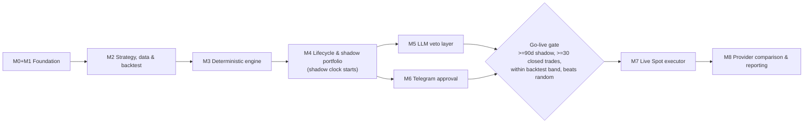

# Crypto Intelligence Platform - Implementation Roadmap (to-do)

**Date:** 2026-10-03
**Inputs:** `docs/architecture/reference-architecture-v1.0.md`, `docs/reviews/2026-10-03-gap-analysis.md`
**Owner decisions:** us-east-1 · single AWS account (`258485600712`, profile `soworks`) · Telegram approvals · Binance.com venue (owner in Colombia)

Each milestone becomes its own detailed, test-driven plan (`docs/plans/<date>-<milestone>.md`)
written just before it starts, so it can account for what the previous milestone
learned. Only Phase 1 (M0 + M1) is detailed now:
[`2026-10-03-phase1-foundation.md`](2026-10-03-phase1-foundation.md).

## What changed from the reference doc's M0-M7

| Reference doc | This roadmap | Why |
|---|---|---|
| M2 Discovery & quant engine | **M2 Strategy, data & backtest foundation**, then **M3 Deterministic engine** | Edge must be specified and validated on survivorship-free history before scoring code is written (B1, B5, B11). |
| M3 Bedrock decision layer | **M5 LLM veto layer** | LLM is veto/explain only and evaluated against a running deterministic shadow baseline (B12). |
| M4 Shadow portfolio | **M4 Position lifecycle & shadow portfolio** | Adds exits, sizing, regime, core DCA, benchmarks; shadow clock starts here (B2-B4, B8, B9, B11). |
| M5 Approval workflow | **M6 Telegram approval** | Approves whole trade plans with pre-authorized exits (A8, B3, B14). |
| M6 Live Spot executor | **M7 Live Spot executor** | Adds static egress, symbol filters, tax-grade fills, custody caps (A2, B10, B13). |
| M7 Provider comparison | **M8 Provider comparison & reporting** | Unchanged intent, plus tax export. |

## Dependency view

---

## M0 + M1 - Foundation  *(detailed plan ready)*

Plan: [`2026-10-03-phase1-foundation.md`](2026-10-03-phase1-foundation.md)

- [ ] Toolchain: uv, ruff, mypy (strict), pytest + hypothesis + moto, pre-commit, Makefile
- [ ] Binance/Bedrock reachability spike from Lambda in us-east-1 and sa-east-1 → ADR-0003
- [ ] ADRs 0001-0007 (risk authority, universe, region/gateway, account isolation, storage, orchestration, package layout)
- [ ] Versioned, fail-closed investment policy loader (fractions vs bps units fixed)
- [ ] SSM execution flags read fail-closed (`EXECUTION_MODE`, `TRADING_ENABLED`, `KILL_SWITCH`)
- [ ] Append-only ledger model + repository (GSI by correlation ID and by type/day)
- [ ] Terraform bootstrap: state bucket (native lockfile), GitHub OIDC, plan/dev/prod roles, per-env permission boundaries, budget, CloudTrail
- [ ] GitHub: environments, variables, branch protection (resolve private-repo plan limits)
- [ ] Dev stack: S3 data bucket, ledger/state/counters tables, SSM flags, SNS alerts, Step Functions skeleton pipeline, hourly schedule, alarms
- [ ] CI: PR checks (lint/type/test/audit, fmt/tflint/checkov, dev plan) and deploy-dev with integration + IAM negative tests

**Exit:** dev deploys via OIDC; pipeline writes SCAN_STARTED/SCAN_COMPLETED in SHADOW; IAM negative tests pass; budget/CloudTrail/alarms live.

---

## M2 - Strategy, data & backtest foundation

**Decisions first**
- [ ] ADR-0008 Strategy spec: hypothesis, daily 00:00 UTC timeframe, 2-8 week holds, entry/exit/sizing summary, kill criteria (B1)
- [ ] ADR-0009 Venue & jurisdiction: Binance.com, `execution_venue` config, tax residency, fee schedule used in simulations (B13)
- [ ] Owner inputs recorded in policy: starting portfolio value, monthly contribution, core vs discovery budgets (B8, B9)
- [ ] Policy schema v2: universe thresholds and exclusions (B6), fundamentals gates (B7), regime block (B4), sizing/limits/circuit breakers (B8), exits (B2), approval TTL/drift (B14) - values as versioned hypotheses with boundary tests

**Exchange access**
- [ ] `BinanceMarketAdapter` protocol + HTTP implementation with configurable base URL (`https://data-api.binance.vision` in AWS per ADR-0003), central weight-aware rate limiter, 429 backoff, hard stop on 418 (A1, A11)
- [ ] Smoke test in dev that the market-data adapter reaches `data-api.binance.vision` from Lambda; alarm if it starts returning 451
- [ ] Recorded, sanitized contract fixtures for `exchangeInfo`, `ticker/24hr`, `klines`, `depth`

**Point-in-time history**
- [ ] Ingest Binance public data dumps (`data.binance.vision`) daily klines for all USDT pairs **including delisted** into S3 (Parquet) (A4, B11)
- [ ] Point-in-time universe table: listing/delisting dates, status changes, monitoring/seed tags, migrations/redenominations (MATIC→POL, FTM→S, 1000x tickers) with continuity stitching (B6)
- [ ] Verify delisted coverage (LUNA 2022-05, FTT 2022-11, 2023-25 delisting waves) with tests
- [ ] Start recording now (not backtestable later): CoinGecko `/global` dominance, DefiLlama stablecoin supply, Binance futures funding & open interest, per-scan spread/depth snapshots (B4, B5)

**Backtest harness**
- [ ] Event-driven daily simulator using the *same* feature/scoring/exit code as production; next-bar fills; venue fees + spread + slippage; walk-forward splits (B11)
- [ ] Benchmarks: money-weighted BTC DCA and BTC/ETH DCA with identical cash flows; equal-weight eligible universe; random-selection baseline (1,000 runs) (B11)
- [ ] Metrics module: excess vs BTC, IRR/TWR, Sharpe/Sortino (365d), max DD, Calmar, hit rate, payoff, expectancy (R), profit factor, exposure-adjusted return, beta/alpha, MAE/MFE, turnover, fee drag (B11)

**Exit:** strategy and venue ADRs accepted; survivorship-free dataset with delisted pairs in S3; benchmark backtests reproducible from a single command; no scoring code merged yet.

---

## M3 - Deterministic engine (no LLM)

- [ ] Universe discovery from `exchangeInfo` + per-scan snapshot to S3; ledger references snapshot key + SHA-256 (A4)
- [ ] Eligibility gates (normal and high-risk lanes) and complete exclusion lists (stablecoins, wrapped/LST, fan tokens, non-TRADING, monitoring tag, delisting, suspended deposits/withdrawals, migrations) (B6)
- [ ] Liquidity gates on 30-day medians; spread/depth from snapshots (B6)
- [ ] Manipulation heuristics → `manipulation_suspect` with 7-day escalation block (B6)
- [ ] Fundamentals adapters (CoinGecko Demo primary, CMC cross-check, DefiLlama) with explicit missing-data semantics and verified asset↔CoinGecko ID map (B7)
- [ ] Regime classifier with hysteresis; per-regime discovery policy (B4)
- [ ] Features on daily candles: returns vs BTC (30/90d, skip recent), EMA/ATR/RSI, extension metrics, beta/correlation to BTC, taker-buy ratio, trade-count stats (B5)
- [ ] Score v2 (trend/RS + extension penalty + small tokenomics component); liquidity and portfolio fit removed from the score (B5)
- [ ] Information-coefficient study per component and regime on the M2 dataset; freeze weights in policy (B5)
- [ ] New-listing lane: 90 days to high-risk lane, 200 days to normal lane; listing never creates BUY (B6)
- [ ] Step Functions pipeline v2: Discover → Gates → Features (Map over batches) → Regime → Score → Record; switch schedule to daily after 00:00 UTC close (A3, B5)
- [ ] Funnel telemetry metrics per stage (reference §9.2, §15.1)

**Exit:** daily scheduled scan produces explainable, reproducible ranked candidates (or none in RISK_OFF) from stored inputs; IC results documented; zero Bedrock calls.

---

## M4 - Position lifecycle & shadow portfolio  *(shadow clock starts)*

- [ ] Portfolio model incl. off-exchange holdings (manual entry) and USDC reserve; core vs discovery sleeves with separate budgets (B9, B13)
- [ ] Deterministic sizing: risk-per-trade, stop distance, beta adjust, regime multiplier, min position ≥ max($25, 4× min notional) (B8)
- [ ] Limits and circuit breakers: max 5 discovery positions, 2 per sector, beta-weighted exposure cap, drawdown halts, loss-streak pause, re-entry cooldown, monthly loss halt (B8)
- [ ] Symbol-filter validator from live `exchangeInfo` incl. exit simulation after fees (B10)
- [ ] Position state machine `PROPOSED → … → CLOSED` in the `state` table; every transition is a ledger event (B2)
- [ ] Deterministic exits: ATR stop, partial take-profit, chandelier trail, time stop, max holding, forced-exit triggers (B2)
- [ ] Exits exempt from buy budgets; property test "a sell can never be blocked by a buy budget" (B3)
- [ ] Hourly position monitor (Step Functions or Lambda on schedule) (B2)
- [ ] Core DCA sleeve: weekly BTC/ETH 70/30, band rebalancing ≤ monthly, reserve deployment rules (B9)
- [ ] Shadow fill simulator: next-bar, fees, spread, slippage, partial fills (B10)
- [ ] Atomic counters for daily/monthly trade USD in the `counters` table (A5)
- [ ] Outcome evaluator: signal study for every scored candidate (7/14/30/60d vs BTC) + trade P&L + portfolio equity curve vs benchmarks, net of platform cost (B11, B10)
- [ ] CloudWatch dashboard; critical alarm on any execution attempt while SHADOW (A13)
- [ ] **Prod environment stack** (`terraform/environments/prod`, deploy-prod workflow with environment approval, deletion protection, 90-day logs); start shadow in prod
  - First extract one thin shared local module that wraps the community modules; `environments/dev` and `environments/prod` both call it, so they cannot drift (ADR-0008). Moving dev onto it must plan with 0 destroys / 0 replacements (`moved` blocks).
  - The state bucket stays a plain resource with `prevent_destroy` (ADR-0008).
- [ ] Property tests from reference §12.2 extended with exits and budgets

**Exit:** prod shadow running daily; every shadow trade has entry, stop, exits, and outcome records; benchmark comparison report generated weekly.

---

## M5 - LLM veto layer (Bedrock)

- [ ] **Prerequisite (start during M2):** submit the Anthropic use-case form in the Bedrock console and request Service Quotas increases for the chosen model's cross-region inference profile. Current quotas are 0 (ADR-0003).
- [ ] `DecisionProvider` protocol; `BedrockProvider` using Converse with structured output or forced tool-use; local Pydantic validation (A10)
- [ ] Decision schema v2: `PASS | DOWNGRADE_WATCH | VETO`, risk flags, bear case, missing evidence; **no sizing field**; may only tighten machine-checkable invalidation (B12)
- [ ] Dossier builder with B12 contents; untrusted-text handling; no secrets; prompt versioned in `prompts/` (B12, reference §16)
- [ ] LLM gate: score/regime thresholds, atomic daily/monthly call counters, dossier-hash dedupe with TTL (A5, reference §5.3)
- [ ] Default model Claude Haiku 4.5 via `us.` inference profile; model ID / profile ARN / tokens / estimated cost recorded per decision (A10)
- [ ] Bedrock model invocation logging to S3 (A10)
- [ ] Offline eval harness: golden dossier set; CI stub run on every prompt/model change; on-demand live run (A10)
- [ ] Ablation arm: shadow-track deterministic-only and LLM decisions incl. vetoed candidates; Brier calibration; flip rate across 3 reruns (B12)
- [ ] Analyzer stage added to the Step Functions pipeline (Map, max concurrency 1-2) (A3)

**Exit:** only qualified candidates invoke Bedrock; every decision replayable; ablation report live; monthly AI cost visible.

---

## M6 - Telegram approval workflow

- [ ] Telegram bot; webhook via API Gateway HTTP API; secret-token header check; owner user-ID allowlist (A8)
- [ ] Approval card with B14 fields; reason codes on reject; daily batch after 00:00 UTC close (B14)
- [ ] Signed, single-use callbacks (KMS-backed HMAC + nonce); TTL 240 min; ATR-based drift checks; full revalidation at approval (A8, B14)
- [ ] Approval covers the entire trade plan (entry + stop + target) (B3)
- [ ] `/kill`, `/status`, `/positions` commands; `/kill` sets SSM kill switch (A8, A9)
- [ ] Alarm forwarding (SNS → Telegram) for critical alarms (A13)
- [ ] Approval-rate and latency-cost metrics (B11, B14)

**Exit:** approvals/rejections fully audited in shadow; executor still disabled.

---

## Go-live gate (owner review, not code)

- [ ] ≥ 90 days of prod shadow **and** ≥ 30 closed shadow trades (B11)
- [ ] Shadow results within the backtest's expected band (B11)
- [ ] Discovery not worse than random-selection baseline, net of costs (B11)
- [ ] LLM ablation reviewed; LLM demoted to explain-only if veto adds no value (B12)
- [ ] Policy v-next reviewed and merged via PR (flags are Terraform-managed)

---

## M7 - Live Spot executor

- [ ] Exchange gateway Lambda in sa-east-1 for signed endpoints; core invokes it cross-region with IAM limited to one function ARN (ADR-0003)
- [ ] Static egress in gateway region (NAT instance + EIP) or documented key-policy alternative (A2)
- [ ] Binance Ed25519 trade-only key, withdrawals disabled, IP-restricted; Secrets Manager with resource policy limited to `cip-prod-executor` (A2, reference §8.2)
- [ ] Executor: `LIMIT_MAKER`/limit-at-mid entries with timeout, exchange-native stop/OCO at entry, `newClientOrderId` = idempotency key, partial-fill handling, timeout reconciliation (B3, B10)
- [ ] Fee handling in BNB with tracked float; dust conversion logged (B10)
- [ ] Tax-grade fill records (trade/order IDs, fee asset, USD value, lot ID, basis method) (B13)
- [ ] Exchange balance cap + monthly self-custody sweep reminder (B13)
- [ ] Restore drill (DynamoDB PITR, S3 versions) documented (A15)
- [ ] Prod flags change via PR only; first tiny approved order executes once and is fully audited

**Exit:** reference doc M6 criteria met with B3/B10/B13 controls.

---

## M8 - Provider comparison & reporting

- [ ] Alternative `DecisionProvider` (e.g., Nova 2 Lite or another vendor) behind the same contract
- [ ] Cost/quality comparison on the golden set and live ablation
- [ ] Koinly/CoinTracker-compatible CSV export; 7-year retention policy (B13)
- [ ] Monthly performance report: after-cost and estimated after-tax vs benchmarks (B11, B13)

## Open owner inputs (block M2 policy values)

- [ ] Starting portfolio value and monthly contribution
- [ ] Confirm Colombian tax residency
- [ ] GitHub plan / repo visibility (branch protection, environment reviewers)
- [ ] Confirm US$0/month paid data in v1 (manual unlock checks)
